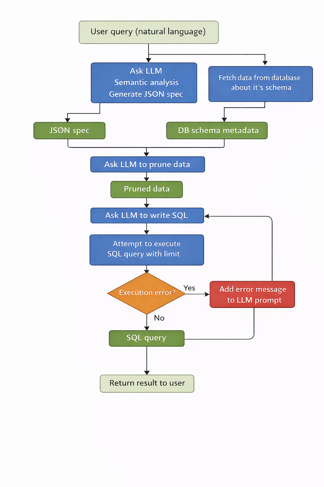
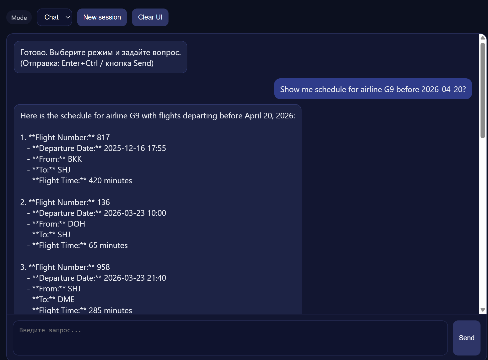

# Text-to-SQL Copilot  
*(Part 1 — without RAG)*

🚧 **Status:** Work in progress

Text-to-SQL Copilot is a system that allows users to query relational databases using **natural language**, without requiring any knowledge of SQL or the underlying database schema.

The system behaves like a conversational LLM assistant.  
When a user request requires database access, the agent automatically switches into **SQL generation mode**, executes the query, and returns the result.

A key design principle of this project is **schema-awareness without schema prompting**:  
the LLM does not rely on manually provided schema descriptions. Instead, the system dynamically retrieves database schema metadata and uses it during query generation.

---

## Key features

- Natural language → SQL query generation
- No prior knowledge of database schema required
- Dynamic schema introspection (tables, columns, relations)
- Iterative SQL refinement based on execution errors
- Optional SQL transparency (generated SQL can be shown to the user)
- Session-based conversational context
- Observability via Prometheus & Grafana
- Supports both local and cloud-based LLMs

---

## Architecture Overview

<p align="center">
  
  
</p>

The system follows a **multi-stage orchestration pipeline** designed to minimize prompt size, reduce hallucinations, and improve SQL correctness.

### 1. User query ingestion
The user submits a natural language request describing the data they want to retrieve.

### 2. Semantic analysis & intent extraction
The LLM performs semantic analysis of the user query and generates a **structured JSON specification** describing:
- entities of interest
- filters and conditions
- aggregations
- expected output format

This step is intentionally decoupled from SQL generation.

### 3. Dynamic schema introspection
In parallel, the system queries the database to retrieve **schema metadata**, including:
- table names
- column definitions
- relationships and foreign keys
- optional comments and constraints

This ensures the LLM always operates on **up-to-date schema information**.

### 4. Schema-aware data pruning
The JSON specification and schema metadata are provided to the LLM, which prunes irrelevant tables and columns.

The result is a **minimal, task-specific schema context**, significantly reducing token usage and cognitive load for the model.

### 5. SQL generation
Using the pruned schema, the LLM generates a SQL query tailored to the user’s intent.

### 6. Execution & error-driven refinement
The generated SQL is executed against the database.

- If execution succeeds, the result is returned to the user.
- If an execution error occurs, the error message is appended to the prompt and the LLM retries SQL generation.

This feedback loop continues until the query succeeds or a retry limit is reached.

---

## Project components

- **Backend:** FastAPI (session-based chat, orchestration, SQL execution)
- **Frontend:** Simple single-page web client
- **LLM runtime:** OpenAI API or local models via Ollama
- **Observability:** Prometheus (metrics), Grafana (dashboards)

---

## LLM configuration

The project supports both **OpenAI** and **local LLMs**.

### OpenAI

```env
LLM_PROVIDER=openai
OPENAI_API_KEY=your_api_key_here
OPENAI_MODEL=gpt-4o-mini


